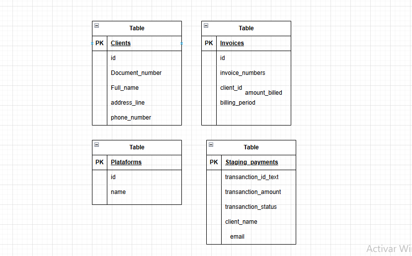

# 📦 Invoice Management System

This is a backend app to **manage invoices**.  
You can **create, list, and delete invoices** in a MySQL database.  
It is made with **Node.js** and **Express**.

---

## 🚀 Features

- **Basic CRUD** for invoices:
  - ➕ Add new invoices
  - ❌ Delete invoices by ID
  - 📄 List all invoices
- **REST API** with JSON responses
- **MySQL** database connection
- **Modular architecture** (`routes`, `controllers`, `db`)

---

## 🛠 Technologies

- **Backend**: Node.js + Express.js
- **Database**: MySQL
- **Dev Tools**: Nodemon, MySQL Workbench
- **Response Format**: JSON

---

## 📂 Project Structure

```
PD--DB-DW/
├── back-end/
│   ├── node_modules/
│   ├── .env
│   ├── package-lock.json
│   ├── package.json
│   └── server.js
├── front-end/
│   ├── node_modules/
│   ├── public/
│   └── src/
│       ├── main.js
│       ├── .gitignore
│       ├── data.csv
│       ├── index.html
│       ├── package-lock.json
│       └── package.json
└── readme.md
```

---

## ⚙ Install and Setup

### Requirements

- Node.js v14+
- MySQL
- npm or yarn

### Steps

1️⃣ **Clone the repository**

```bash
git clone https://github.com/JoelR19/PD--db-dw
cd PD-DB-DW
```

2️⃣ **Install dependencies**

```bash
npm install
```

3️⃣ **Set up the database**

- Create the database:

```sql
CREATE DATABASE pd_joel_restrepo_tayrona;
```

- Set your database info in `src/db/connection.js`

4️⃣ **Create the invoices table**

```sql
CREATE TABLE invoices (
  id INT AUTO_INCREMENT PRIMARY KEY,
  client VARCHAR(100) NOT NULL,
  amount DECIMAL(10,2) NOT NULL,
  date DATE NOT NULL
);
```

---

## ▶ How to Use

**Start the server**

```bash
npm run dev
```

**Available Endpoints**

| Method | Endpoint          | Description             |
| ------ | ----------------- | ----------------------- |
| GET    | /api/invoices     | List all invoices       |
| POST   | /api/invoices     | Create a new invoice    |
| DELETE | /api/invoices/:id | Delete an invoice by ID |

---

## 📌 Example JSON (POST /api/invoices)

```json
{
  "id": 68,
  "invoice_number": "FAC2139",
  "client_id": 68,
  "billing_period": "2024-07-01T05:00:00.000Z",
  "amount_billed": "197548.00",
  "created_at": "2025-08-12T20:50:16.000Z",
  "full_name": "Miss Carrie Underwood"
}
```

---

## 🗄 Database Diagram



---

## 🤝 How to Contribute

1. Fork this repo
2. Make a new branch (`git checkout -b feature/new-feature`)
3. Commit changes (`git commit -m "Description"`)
4. Push to your branch (`git push origin feature/new-feature`)
5. Make a Pull Request

---

## 📄 License

## If you want to use it, give me a hamburger.

## 👤 Author

- **Your Name**
- GitHub: [@JoelR19](https://github.com/JoelR19)
